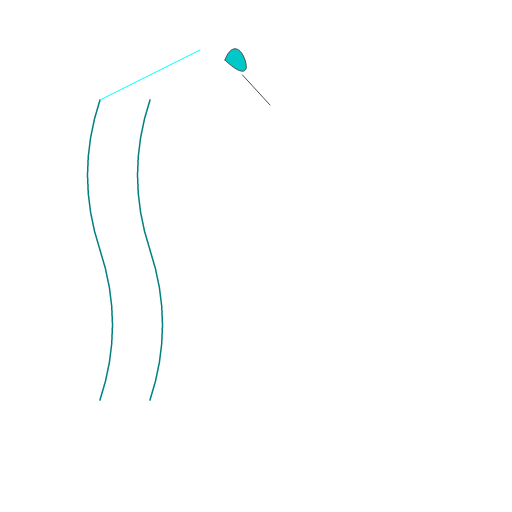
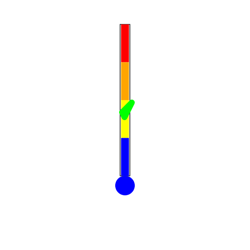
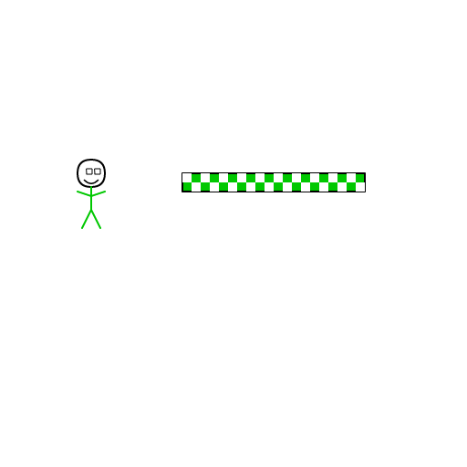
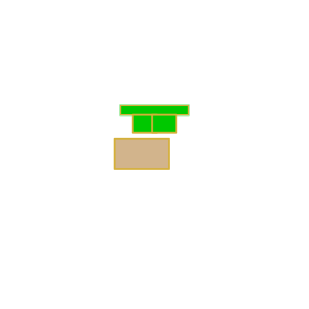

# Tool badges

Each tool `uni` orchestrates has a custom emoji badge, generated with
[xpressive](https://github.com/elci-group/xpressive)'s `.xpr` vector format:
a real generate → critique → revise loop against a live LLM (not a stock
icon set), scored by an automated critic against the brief until it hit its
target score or exhausted its revision budget. The `.xpr` source for each
badge sits next to its rendered PNG in `docs/emoji/`, so any of them can be
re-rendered at another size or revised further without regenerating from
scratch.

These badges are documentation-only. The terminal report
(`uni analyze`, `uni --json`) always uses plain Unicode emoji — raw ANSI
text can't display a rendered image — so nothing here changes what running
`uni` prints.

| | Tool | Purpose |
|---|---|---|
|  | **amber** | dependency bloat / replaceability |
|  | **ami** | project profile completeness (market-intelligence readiness) |
|  | **bart** | filesystem size & hotspots (informational) |
|  | **chakra** | data-flow / architecture map coverage |
|  | **ferret** | repository-specific review findings (hunt) |
|  | **fract** | module entropy, cohesion, duplication |
|  | **isopod** | ISO27001/27002 compliance posture |
|  | **jeenome** | behavioural trace analysis (opt-in) |
|  | **lwoodz** | license / SPDX compliance |
|  | **tempcheq** | LLM sampling-temperature correctness |
|  | **traci** | observability/telemetry completeness |
|  | **vamos** | nominal vs. validated action completion |
|  | **viva-palestina** | ethical vendor / dependency policy compliance |

## Regenerating a badge

```bash
cd ~/xpressive
./target/release/xpr-demo generate "<brief>" \
  --generator groq:openai/gpt-oss-120b --cycles 2 \
  --out /home/sal/uni/docs/emoji/<tool>.png
```

The command prints its cache digest (`cached as sha256:...`); the matching
`.xpr` source can be pulled from `~/.cache/xpressive/sha256/<prefix>/` and
copied over `docs/emoji/<tool>.xpr` to keep source and render in sync.
